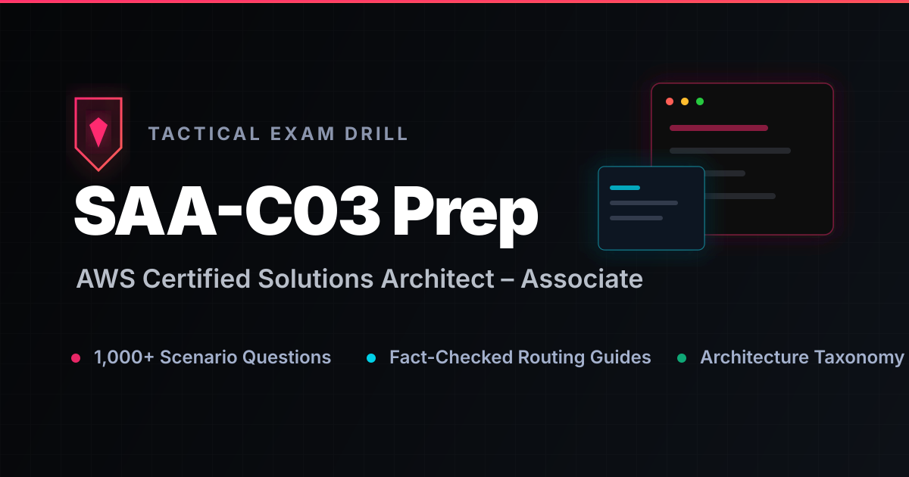

<div align="center">
  
  <br/><br/>
  
  <h1>🛡️ AWS Certified Solutions Architect – Associate (SAA-C03)</h1>
  
  <p>
    <a href="https://github.com/atakang7/saaprep/actions"></a>
    
    
  </p>

  <p>
    <a href="https://atakang7.github.io/saaprep/"><b>Launch Platform</b></a> •
    <a href="#architecture-taxonomy-tree"><b>Taxonomy Tree</b></a> •
    <a href="#tech-stack"><b>Tech Stack</b></a> •
    <a href="#local-development"><b>Local Dev</b></a>
  </p>
  
  <br/>
</div>

<!-- TREE_START -->

### 🗺️ Architecture Taxonomy Tree

- **[Guard (Access and Data)](https://atakang7.github.io/saaprep/concepts#guard-access-and-data)**
  - [Identity and permissions](https://atakang7.github.io/saaprep/topics/identity-and-permissions)
    - [IAM](https://atakang7.github.io/saaprep/services/iam)
    - [IAM Identity Center](https://atakang7.github.io/saaprep/services/iam-identity-center)
    - [Organizations SCPs](https://atakang7.github.io/saaprep/services/organizations-scps)
    - [Cognito](https://atakang7.github.io/saaprep/services/cognito)
  - [Encryption and secrets](https://atakang7.github.io/saaprep/topics/encryption-and-secrets)
    - [KMS](https://atakang7.github.io/saaprep/services/kms)
    - [CloudHSM](https://atakang7.github.io/saaprep/services/cloudhsm)
    - [Secrets Manager](https://atakang7.github.io/saaprep/services/secrets-manager)
    - [Parameter Store](https://atakang7.github.io/saaprep/services/parameter-store)
    - [Macie](https://atakang7.github.io/saaprep/services/macie)
    - [S3 Server-Side Encryption (SSE)](https://atakang7.github.io/saaprep/services/s3-server-side-encryption-sse)
  - [Network/application protection](https://atakang7.github.io/saaprep/topics/network-application-protection)
    - [WAF](https://atakang7.github.io/saaprep/services/waf)
    - [Shield](https://atakang7.github.io/saaprep/services/shield)
    - [Security Groups](https://atakang7.github.io/saaprep/services/security-groups)
    - [NACLs](https://atakang7.github.io/saaprep/services/nacls)
    - [Network Firewall](https://atakang7.github.io/saaprep/services/network-firewall)
  - [Audit, detection, compliance](https://atakang7.github.io/saaprep/topics/audit-detection-compliance)
    - [CloudTrail](https://atakang7.github.io/saaprep/services/cloudtrail)
    - [GuardDuty](https://atakang7.github.io/saaprep/services/guardduty)
    - [Security Hub](https://atakang7.github.io/saaprep/services/security-hub)
    - [Inspector](https://atakang7.github.io/saaprep/services/inspector)
    - [Config](https://atakang7.github.io/saaprep/services/config)
    - [AWS X-Ray](https://atakang7.github.io/saaprep/services/aws-x-ray)
    - [CloudWatch Logs Insights](https://atakang7.github.io/saaprep/services/cloudwatch-logs-insights)
- **[Connect (Traffic)](https://atakang7.github.io/saaprep/concepts#connect-traffic)**
  - [VPC foundations](https://atakang7.github.io/saaprep/topics/vpc-foundations)
    - [VPCs](https://atakang7.github.io/saaprep/services/vpcs)
    - [Subnets](https://atakang7.github.io/saaprep/services/subnets)
    - [Route Tables](https://atakang7.github.io/saaprep/services/route-tables)
    - [Internet Gateways](https://atakang7.github.io/saaprep/services/internet-gateways)
    - [NAT Gateways](https://atakang7.github.io/saaprep/services/nat-gateways)
    - [NAT Instance](https://atakang7.github.io/saaprep/services/nat-instance)
    - [Elastic IP (EIP)](https://atakang7.github.io/saaprep/services/elastic-ip-eip)
  - [Private AWS access](https://atakang7.github.io/saaprep/topics/private-aws-access)
    - [VPC Endpoints (Gateway, Interface)](https://atakang7.github.io/saaprep/services/vpc-endpoints-gateway-interface)
    - [PrivateLink](https://atakang7.github.io/saaprep/services/privatelink)
  - [Load balancing, DNS, edge](https://atakang7.github.io/saaprep/topics/load-balancing-dns-edge)
    - [Route 53](https://atakang7.github.io/saaprep/services/route-53)
    - [CloudFront](https://atakang7.github.io/saaprep/services/cloudfront)
    - [Global Accelerator](https://atakang7.github.io/saaprep/services/global-accelerator)
    - [ALB](https://atakang7.github.io/saaprep/services/alb)
    - [NLB](https://atakang7.github.io/saaprep/services/nlb)
    - [GLB](https://atakang7.github.io/saaprep/services/glb)
  - [Hybrid and multi-VPC networking](https://atakang7.github.io/saaprep/topics/hybrid-and-multi-vpc-networking)
    - [Site-to-Site VPN](https://atakang7.github.io/saaprep/services/site-to-site-vpn)
    - [Direct Connect](https://atakang7.github.io/saaprep/services/direct-connect)
    - [Transit Gateway](https://atakang7.github.io/saaprep/services/transit-gateway)
    - [VPC peering](https://atakang7.github.io/saaprep/services/vpc-peering)
    - [AWS VPN CloudHub](https://atakang7.github.io/saaprep/services/aws-vpn-cloudhub)
    - [AWS Resource Access Manager (RAM)](https://atakang7.github.io/saaprep/services/aws-resource-access-manager-ram)
- **[Run (Compute)](https://atakang7.github.io/saaprep/concepts#run-compute)**
  - [Compute choice](https://atakang7.github.io/saaprep/topics/compute-choice)
    - [EC2](https://atakang7.github.io/saaprep/services/ec2)
    - [Elastic Beanstalk](https://atakang7.github.io/saaprep/services/elastic-beanstalk)
    - [EC2 Spot Instances](https://atakang7.github.io/saaprep/services/ec2-spot-instances)
    - [EC2 Reserved Instances](https://atakang7.github.io/saaprep/services/ec2-reserved-instances)
    - [EC2 Placement Groups](https://atakang7.github.io/saaprep/services/ec2-placement-groups)
    - [AWS CloudFormation](https://atakang7.github.io/saaprep/services/aws-cloudformation)
  - [Scaling](https://atakang7.github.io/saaprep/topics/scaling)
    - [Auto Scaling Groups (ASG)](https://atakang7.github.io/saaprep/services/auto-scaling-groups-asg)
    - [Launch Templates](https://atakang7.github.io/saaprep/services/launch-templates)
    - [Amazon CloudWatch](https://atakang7.github.io/saaprep/services/amazon-cloudwatch)
    - [Elastic Load Balancing (ELB)](https://atakang7.github.io/saaprep/services/elastic-load-balancing-elb)
  - [Serverless](https://atakang7.github.io/saaprep/topics/serverless)
    - [Lambda](https://atakang7.github.io/saaprep/services/lambda)
    - [Lambda reserved concurrency](https://atakang7.github.io/saaprep/services/lambda-reserved-concurrency)
    - [Compute Savings Plans](https://atakang7.github.io/saaprep/services/compute-savings-plans)
  - [Containers and APIs](https://atakang7.github.io/saaprep/topics/containers-and-apis)
    - [ECS](https://atakang7.github.io/saaprep/services/ecs)
    - [EKS](https://atakang7.github.io/saaprep/services/eks)
    - [Fargate](https://atakang7.github.io/saaprep/services/fargate)
    - [API Gateway](https://atakang7.github.io/saaprep/services/api-gateway)
- **[Store (Data)](https://atakang7.github.io/saaprep/concepts#store-data)**
  - [Storage shape](https://atakang7.github.io/saaprep/topics/storage-shape)
    - [EBS](https://atakang7.github.io/saaprep/services/ebs)
    - [EFS](https://atakang7.github.io/saaprep/services/efs)
    - [FSx](https://atakang7.github.io/saaprep/services/fsx)
    - [EC2 instance store](https://atakang7.github.io/saaprep/services/ec2-instance-store)
  - [S3 lifecycle/archive/protection](https://atakang7.github.io/saaprep/topics/s3-lifecycle-archive-protection)
    - [S3 Storage Classes](https://atakang7.github.io/saaprep/services/s3-storage-classes)
    - [Lifecycle Rules](https://atakang7.github.io/saaprep/services/lifecycle-rules)
    - [Object Lock](https://atakang7.github.io/saaprep/services/object-lock)
    - [S3 Versioning](https://atakang7.github.io/saaprep/services/s3-versioning)
    - [S3 Multipart Upload](https://atakang7.github.io/saaprep/services/s3-multipart-upload)
    - [S3 Reduced Redundancy Storage (RRS)](https://atakang7.github.io/saaprep/services/s3-reduced-redundancy-storage-rrs)
  - [Backup and migration](https://atakang7.github.io/saaprep/topics/backup-and-migration)
    - [AWS Backup](https://atakang7.github.io/saaprep/services/aws-backup)
    - [DataSync](https://atakang7.github.io/saaprep/services/datasync)
    - [Snow Family](https://atakang7.github.io/saaprep/services/snow-family)
    - [Amazon EBS snapshots](https://atakang7.github.io/saaprep/services/amazon-ebs-snapshots)
    - [AWS Storage Gateway](https://atakang7.github.io/saaprep/services/aws-storage-gateway)
  - [Hybrid storage](https://atakang7.github.io/saaprep/topics/hybrid-storage)
    - [Storage Gateway](https://atakang7.github.io/saaprep/services/storage-gateway)
    - [AWS Storage Gateway File Gateway](https://atakang7.github.io/saaprep/services/aws-storage-gateway-file-gateway)
    - [AWS Storage Gateway Volume Gateway (cached)](https://atakang7.github.io/saaprep/services/aws-storage-gateway-volume-gateway-cached)
    - [AWS Storage Gateway Volume Gateway (stored)](https://atakang7.github.io/saaprep/services/aws-storage-gateway-volume-gateway-stored)
- **[Remember and query data (Databases & Analytics)](https://atakang7.github.io/saaprep/concepts#remember-and-query-data-databases-analytics)**
  - [Relational databases](https://atakang7.github.io/saaprep/topics/relational-databases)
    - [RDS](https://atakang7.github.io/saaprep/services/rds)
    - [Aurora](https://atakang7.github.io/saaprep/services/aurora)
    - [RDS Multi-AZ](https://atakang7.github.io/saaprep/services/rds-multi-az)
    - [RDS Read Replicas](https://atakang7.github.io/saaprep/services/rds-read-replicas)
    - [RDS Proxy](https://atakang7.github.io/saaprep/services/rds-proxy)
    - [AWS DMS](https://atakang7.github.io/saaprep/services/aws-dms)
  - [NoSQL](https://atakang7.github.io/saaprep/topics/nosql)
    - [DynamoDB](https://atakang7.github.io/saaprep/services/dynamodb)
  - [Cache](https://atakang7.github.io/saaprep/topics/cache)
    - [ElastiCache](https://atakang7.github.io/saaprep/services/elasticache)
    - [DAX](https://atakang7.github.io/saaprep/services/dax)
    - [Amazon ElastiCache for Memcached](https://atakang7.github.io/saaprep/services/amazon-elasticache-for-memcached)
  - [Search](https://atakang7.github.io/saaprep/topics/search)
    - [OpenSearch](https://atakang7.github.io/saaprep/services/opensearch)
  - [Analytics and streaming](https://atakang7.github.io/saaprep/topics/analytics-and-streaming)
    - [Redshift](https://atakang7.github.io/saaprep/services/redshift)
    - [Athena](https://atakang7.github.io/saaprep/services/athena)
    - [EMR](https://atakang7.github.io/saaprep/services/emr)
    - [Kinesis](https://atakang7.github.io/saaprep/services/kinesis)
    - [Glue](https://atakang7.github.io/saaprep/services/glue)
    - [Amazon Data Firehose](https://atakang7.github.io/saaprep/services/amazon-data-firehose)
- **[Decouple and operate (Architecture & Management)](https://atakang7.github.io/saaprep/concepts#decouple-and-operate-architecture-management)**
  - [Messaging](https://atakang7.github.io/saaprep/topics/messaging)
    - [SQS](https://atakang7.github.io/saaprep/services/sqs)
    - [SNS](https://atakang7.github.io/saaprep/services/sns)
    - [Amazon SES (Simple Email Service)](https://atakang7.github.io/saaprep/services/amazon-ses-simple-email-service)
  - [Events & Workflows](https://atakang7.github.io/saaprep/topics/events-workflows)
    - [EventBridge](https://atakang7.github.io/saaprep/services/eventbridge)
    - [Step Functions](https://atakang7.github.io/saaprep/services/step-functions)
    - [Amazon SWF (Simple Workflow Service)](https://atakang7.github.io/saaprep/services/amazon-swf-simple-workflow-service)
  - [DR and availability](https://atakang7.github.io/saaprep/topics/dr-and-availability)
    - [Route 53 routing](https://atakang7.github.io/saaprep/services/route-53-routing)
    - [Multi-Region setups](https://atakang7.github.io/saaprep/services/multi-region-setups)
    - [Amazon EC2 AMIs (Amazon Machine Images)](https://atakang7.github.io/saaprep/services/amazon-ec2-amis-amazon-machine-images)
    - [Elastic Load Balancing (ELB)](https://atakang7.github.io/saaprep/services/elastic-load-balancing-elb)
    - [Amazon RDS](https://atakang7.github.io/saaprep/services/amazon-rds)
    - [Amazon S3](https://atakang7.github.io/saaprep/services/amazon-s3)
  - [Cost and governance](https://atakang7.github.io/saaprep/topics/cost-and-governance)
    - [Cost Explorer](https://atakang7.github.io/saaprep/services/cost-explorer)
    - [AWS Budgets](https://atakang7.github.io/saaprep/services/aws-budgets)
    - [Organizations](https://atakang7.github.io/saaprep/services/organizations)
    - [AWS Control Tower](https://atakang7.github.io/saaprep/services/aws-control-tower)
    - [Compute Savings Plans](https://atakang7.github.io/saaprep/services/compute-savings-plans)
    - [Consolidated billing (AWS Organizations)](https://atakang7.github.io/saaprep/services/consolidated-billing-aws-organizations)

<!-- TREE_END -->

<br/>

## ⚡ Tech Stack

- **[Astro](https://astro.build/)**: Static site generation for extreme performance.
- **Vanilla CSS**: Global theme tokens, scoped styling, and responsive fluid layout.

<br/>

## 🚀 Local Development

1. **Clone the repository:**
   ```bash
   git clone https://github.com/atakang7/saaprep.git
   cd saaprep
   ```

2. **Install dependencies:**
   ```bash
   npm install
   ```

3. **Start the local development server:**
   ```bash
   npm run dev
   ```

<br/>

##  Design Philosophy

- 🚫 **No generic fluff:** Only verified facts linked directly to official AWS documentation.
- 🚀 **Zero latency:** Static rendering and minimalist payload.
- 🕶️ **Dark-mode native:** Designed for deep work and minimal eye strain.

<br/>

<div align="center">
  <hr>
  <sub>Built for the command-line native. Train the AWS decision reflex.</sub>
</div>
