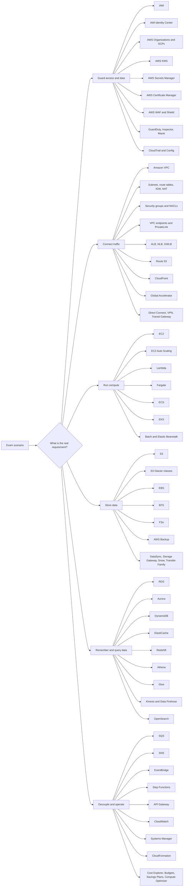

# Cloud Concept Map For SAA Pattern Matching

Last checked against the AWS exam guide and in-scope services: 2026-05-19.

Use this page when you want the shortcut version: do not start by memorizing service names. Start by recognizing the cloud concept the question is testing, then match the requirement to the service that naturally lives in that concept.

Official sources:

- Exam guide: https://docs.aws.amazon.com/aws-certification/latest/solutions-architect-associate-03/solutions-architect-associate-03.html
- Technologies and concepts: https://docs.aws.amazon.com/aws-certification/latest/solutions-architect-associate-03/saa-technologies-concepts.html
- In-scope services: https://docs.aws.amazon.com/aws-certification/latest/solutions-architect-associate-03/saa-03-in-scope-services.html

## The Main Shortcut

Read the question as:

```text
requirement -> cloud concept -> service family -> exact service
```

The exam does not usually ask, "What is every feature of this service?" It asks, "Given this business problem, which architectural move fits best?"

## Big Cloud Tree



## Six Concepts That Make Up The Cloud

| Concept | What it is really about | First question to ask | Common answer shape |
| --- | --- | --- | --- |
| Guard access and data | Identity, permissions, encryption, detection, compliance | Who can access what, and how is data protected? | IAM, KMS, Secrets Manager, WAF, CloudTrail |
| Connect traffic | Network boundaries, routes, private paths, edge delivery | Where does traffic need to go, and should it be public or private? | VPC, endpoints, ELB, Route 53, CloudFront |
| Run compute | Places where code runs and scales | How much control vs operational simplicity is needed? | EC2, Auto Scaling, Lambda, ECS, EKS, Fargate |
| Store data | Object, block, file, archive, backup, migration | What shape is the data and how is it accessed? | S3, EBS, EFS, FSx, Backup, DataSync |
| Remember and query data | Databases, caches, analytics, streams | Is this OLTP, NoSQL, cache, warehouse, stream, or query over files? | RDS, Aurora, DynamoDB, ElastiCache, Redshift, Athena |
| Decouple and operate | Async buffers, event flow, workflows, visibility, cost control | Can pieces fail or scale independently, and how do we run it cleanly? | SQS, SNS, EventBridge, Step Functions, CloudWatch, Cost Explorer |

## Pattern Matching Moves

| If the question says... | Think concept | Reach for |
| --- | --- | --- |
| "Users, teams, accounts, least privilege, temporary credentials" | Guard access | IAM, IAM roles, IAM Identity Center, Organizations SCPs |
| "Encrypt at rest, customer control of keys, rotate database password" | Guard data | KMS, Secrets Manager |
| "Private subnet needs internet updates" | Connect traffic | NAT gateway |
| "Private subnet needs S3 or DynamoDB without public internet" | Connect traffic | Gateway VPC endpoint |
| "Private subnet needs AWS service APIs without public internet" | Connect traffic | Interface VPC endpoint / PrivateLink |
| "HTTP path routing, host routing, web app front door" | Connect traffic | Application Load Balancer |
| "TCP/UDP, extreme throughput, static IP target" | Connect traffic | Network Load Balancer |
| "Global cache, lower latency, origin offload" | Connect traffic | CloudFront |
| "DNS failover, weighted, latency, geolocation" | Connect traffic | Route 53 |
| "Need full OS control or lift and shift" | Run compute | EC2 |
| "Event-driven code with low ops" | Run compute | Lambda |
| "Containers without managing servers" | Run compute | Fargate |
| "Kubernetes" | Run compute | EKS |
| "Object storage, static assets, logs, data lake" | Store data | S3 |
| "Block volume attached to EC2" | Store data | EBS |
| "Shared Linux POSIX file system" | Store data | EFS |
| "Windows file share or HPC file system" | Store data | FSx |
| "Relational SQL, transactions, joins" | Remember/query | RDS or Aurora |
| "Massive key-value scale, single-digit millisecond, serverless NoSQL" | Remember/query | DynamoDB |
| "Hot read cache or session store" | Remember/query | ElastiCache |
| "Warehouse, analytics reports, OLAP" | Remember/query | Redshift |
| "SQL over files in S3" | Remember/query | Athena |
| "Buffer spikes for workers" | Decouple/operate | SQS |
| "One message to many subscribers" | Decouple/operate | SNS |
| "Event bus, SaaS events, routing rules" | Decouple/operate | EventBridge |
| "Multi-step workflow, retries, branching" | Decouple/operate | Step Functions |
| "Metrics, logs, alarms" | Decouple/operate | CloudWatch |
| "Cost trends, alerts, rightsizing, compute commitment" | Decouple/operate | Cost Explorer, Budgets, Compute Optimizer, Savings Plans |

## Service Cards By Concept

Use these as short recognition cards: what the service is about, the three facts that matter most, and the clue words that point at it.

### Guard Access And Data

| Service | About | 3 things that matter | Clue words |
| --- | --- | --- | --- |
| IAM | Identity and permissions inside AWS. | Users/groups/roles; policies grant/deny actions; roles give temporary credentials. | Least privilege, role, policy, instance profile |
| IAM Identity Center | Central workforce access. | Connects identity providers; manages multi-account access; uses permission sets. | SSO, workforce, many accounts |
| AWS Organizations / SCPs | Multi-account management and guardrails. | SCPs set max permissions; SCPs do not grant access; consolidated billing lives here. | Guardrail, member accounts, block service |
| Amazon Cognito | Customer identity for apps. | User pools handle sign-in; identity pools provide AWS credentials; fits web/mobile users. | App users, sign-up, user pool |
| AWS KMS | Encryption key control. | Customer managed keys give policy control; key policies matter; integrates with many AWS services. | Encrypt at rest, customer key, key policy |
| AWS Secrets Manager | Secrets storage and rotation. | Stores secret values; supports rotation patterns; best for database credentials. | Password rotation, secret, credential |
| AWS Certificate Manager | TLS certificate management. | Issues public/private certs; integrates with ALB and CloudFront; reduces certificate ops. | HTTPS, TLS certificate |
| AWS WAF | Layer 7 web filtering. | Blocks HTTP patterns; has managed/rate rules; attaches to CloudFront, ALB, API Gateway. | SQL injection, XSS, rate limit |
| AWS Shield | DDoS protection. | Standard is automatic; Advanced adds stronger response features; often paired with CloudFront/WAF. | DDoS |
| Amazon GuardDuty | Threat detection. | Analyzes account/network/DNS signals; produces findings; does not replace prevention controls. | Suspicious activity, threat detection |
| Amazon Inspector | Vulnerability management. | Finds package/software vulnerabilities; works with workloads/images; reports CVEs. | Vulnerability scan, CVE |
| Amazon Macie | Sensitive data discovery in S3. | Finds PII/sensitive data; focuses on S3; supports classification-driven security. | PII in S3, data discovery |
| AWS CloudTrail | API audit history. | Records who called what API; supports audit and forensics; logs can go to S3/CloudWatch. | Who did what, API history |
| AWS Config | Resource configuration history and rules. | Tracks changes; evaluates compliance; helps detect drift. | Config history, compliance rule |

### Connect Traffic

| Service | About | 3 things that matter | Clue words |
| --- | --- | --- | --- |
| Amazon VPC | Isolated network foundation. | CIDR plus subnets; route tables decide paths; security groups/NACLs filter traffic. | VPC, subnet, route |
| Security groups | Instance or ENI firewall. | Stateful; allow rules only; attached to resources. | Instance firewall, allow inbound |
| Network ACLs | Subnet boundary firewall. | Stateless; allow and deny rules; return traffic needs rules. | Subnet deny, stateless |
| Internet gateway | Public internet path for VPC. | Works with route table; resource needs public IP; common for public subnets. | Public subnet, internet inbound |
| NAT gateway | Outbound IPv4 internet for private subnets. | Lives in public subnet; prevents unsolicited inbound; costs per hour and data processed. | Private instances patch internet |
| VPC endpoints | Private access to AWS services. | Gateway endpoints for S3/DynamoDB; interface endpoints use PrivateLink; can reduce NAT use. | No public internet, private AWS API |
| AWS PrivateLink | Private service exposure. | Uses interface endpoints; avoids public internet; avoids broad network peering. | Private service access |
| Elastic Load Balancing | Distributes traffic to healthy targets. | ALB for HTTP; NLB for TCP/UDP/static IP/high performance; GWLB for appliances. | Load balance, health checks |
| Amazon Route 53 | DNS and routing policy. | Health checks; failover/weighted/latency/geolocation routing; DNS TTL affects speed. | DNS failover, route users |
| Amazon CloudFront | CDN and edge front door. | Caches globally; lowers latency; protects/offloads origins. | Edge cache, global users |
| AWS Global Accelerator | Global anycast acceleration without caching. | Static anycast IPs; optimizes TCP/UDP path; good when content is not cacheable. | Static global IP, no cache |
| AWS Direct Connect | Dedicated private connectivity. | Private physical link; predictable bandwidth; often paired with VPN for encryption/failover. | Dedicated line, consistent network |
| AWS Site-to-Site VPN | Encrypted tunnel to AWS. | IPsec over internet; faster to set up than Direct Connect; bandwidth less predictable. | Encrypted hybrid tunnel |
| AWS Transit Gateway | Hub routing for many networks. | Connects many VPCs/VPNs; simplifies hub-and-spoke; avoids many peerings. | Many VPCs, central router |

### Run Compute

| Service | About | 3 things that matter | Clue words |
| --- | --- | --- | --- |
| Amazon EC2 | Virtual machines with full control. | You manage OS; instance families match workload; best for lift-and-shift/control. | Server, OS control, custom agent |
| EC2 Auto Scaling | Elastic EC2 fleet management. | Scales in/out; replaces unhealthy instances; uses launch templates. | Scale EC2, replace unhealthy |
| AWS Lambda | Event-driven functions. | No server management; scales by concurrency; has timeout/package/runtime limits. | Function, event trigger |
| AWS Fargate | Serverless container compute. | Runs ECS/EKS tasks without EC2 management; pay for task resources; less ops. | Containers without servers |
| Amazon ECS | AWS-native container orchestration. | Tasks/services; integrates well with ALB/Fargate; simpler AWS container path. | ECS tasks, containers |
| Amazon EKS | Managed Kubernetes. | Kubernetes API; useful for existing K8s skills/tools; more operational complexity than ECS. | Kubernetes |
| AWS Batch | Managed batch jobs. | Schedules jobs; manages compute environments; fits queued batch workloads. | Batch jobs, job queue |
| Elastic Beanstalk | Managed app deployment platform. | Deploys common web app stacks; manages underlying resources; less control than raw EC2. | Simple web app deployment |

### Store Data

| Service | About | 3 things that matter | Clue words |
| --- | --- | --- | --- |
| Amazon S3 | Durable object storage. | Object, not block/file; supports lifecycle/versioning/encryption; foundation for static sites/logs/data lakes. | Object, bucket, static assets |
| S3 Glacier classes | Low-cost archive storage. | Cheaper with slower retrieval; fits long retention; choose retrieval class by access need. | Archive, years, rare access |
| Amazon EBS | Block storage for EC2. | Attached to one instance in one AZ for common use; snapshots protect data; performance depends on volume type. | Boot volume, block, low latency |
| Amazon EFS | Shared Linux file system. | POSIX/NFS; multi-AZ shared access; good for many Linux instances. | Shared Linux file |
| Amazon FSx | Managed specialized file systems. | Windows File Server for SMB; Lustre for HPC; ONTAP/OpenZFS for specialized needs. | Windows share, Lustre, HPC |
| AWS Backup | Central backup policy. | Manages backup plans; supports many services; handles retention/cross-account patterns. | Backup policy, retention |
| AWS DataSync | Online storage transfer. | Moves NFS/SMB/object data; supports recurring incremental sync; commonly feeds S3/EFS/FSx. | Online transfer, recurring sync |
| AWS Storage Gateway | Hybrid AWS-backed storage. | File/volume/tape patterns; keeps on-prem access; stores data in AWS. | Hybrid file gateway, tape |
| AWS Snow Family | Physical data transfer or edge. | Useful for huge data/poor bandwidth; offline transfer; some devices support edge compute. | Petabytes, limited bandwidth |
| AWS Transfer Family | Managed file transfer protocols. | SFTP/FTPS/FTP endpoint; stores in S3 or EFS; reduces server management. | SFTP users, FTP |

### Remember And Query Data

| Service | About | 3 things that matter | Clue words |
| --- | --- | --- | --- |
| Amazon RDS | Managed relational database. | SQL engines; Multi-AZ for availability; read replicas for read scale. | MySQL, PostgreSQL, Multi-AZ |
| Amazon Aurora | AWS relational database engine. | MySQL/PostgreSQL compatible; high performance/availability; replicas and global database patterns. | Aurora, high relational performance |
| Aurora Serverless | Variable-capacity Aurora. | Scales capacity with demand; fits intermittent/unpredictable relational workloads; lowers idle management. | Variable relational demand |
| Amazon DynamoDB | Serverless NoSQL key-value/document database. | Single-digit millisecond at scale; on-demand/provisioned capacity; global tables for multi-Region. | Key-value, massive scale |
| Amazon ElastiCache | In-memory cache. | Redis/Memcached; speeds hot reads; common for sessions and database offload. | Cache, session store |
| Amazon Redshift | Data warehouse. | OLAP analytics; columnar large-scale reporting; not for transactional OLTP. | Warehouse, business reports |
| Amazon Athena | Serverless SQL over S3. | No servers; query files/logs in S3; cost tied to scanned data. | SQL over S3, ad hoc |
| AWS Glue | ETL and data catalog. | Crawlers/catalog metadata; transforms data; common for data lakes. | ETL, catalog, CSV to Parquet |
| Amazon Kinesis Data Streams | Real-time streaming ingestion. | Shards; custom consumers; fit clickstreams/events needing real-time processing. | Real-time stream, shards |
| Amazon Data Firehose | Managed stream delivery. | Buffers and delivers to destinations; less custom code; can transform on delivery. | Stream delivery to S3/Redshift |
| Amazon OpenSearch Service | Search and log analytics. | Indexes text/logs; supports dashboards/search; not a general relational database. | Full-text search, log analytics |
| AWS DMS | Database migration and replication. | Supports migration/CDC; source/target databases; good for minimal downtime database moves. | Database migration, CDC |

### Decouple And Operate

| Service | About | 3 things that matter | Clue words |
| --- | --- | --- | --- |
| Amazon SQS | Queue for decoupling workers. | Buffers spikes; at-least-once delivery; DLQs handle failed messages. | Queue, workers, buffer |
| Amazon SNS | Pub/sub fanout. | One message to many subscribers; pushes notifications; integrates with SQS/Lambda/email/HTTP. | Fanout, notification |
| Amazon EventBridge | Event bus and routing. | Event patterns/rules; SaaS and AWS events; good for event-driven app integration. | Event bus, routing rules |
| AWS Step Functions | Workflow orchestration. | State machine; retries/branching/timeouts; coordinates Lambda/ECS/Batch/services. | Workflow, steps, retries |
| Amazon API Gateway | Managed API front door. | REST/HTTP/WebSocket APIs; throttling/auth; common with Lambda. | API, throttling, WebSocket |
| Amazon CloudWatch | Observability basics. | Metrics/logs/alarms/dashboards; drives alerts/scaling decisions; watches symptoms. | Metrics, logs, alarms |
| AWS Systems Manager | Operations for instances/resources. | Session Manager; Patch Manager; Parameter Store and Run Command. | Patch, remote command, session |
| AWS CloudFormation | Infrastructure as code. | Templates/stacks; repeatable infrastructure; reduces drift/manual rebuild. | IaC, stack, template |
| AWS Cost Explorer | Spend analysis. | Historical/forecast costs; service breakdowns; good for investigation. | Analyze spend, forecast |
| AWS Budgets | Cost and usage alerts. | Threshold notifications; forecast alerts; does not itself optimize architecture. | Budget alert |
| Savings Plans | Compute commitment discount. | Commit to spend; applies to eligible compute; good for steady usage. | Steady compute, commitment |
| AWS Compute Optimizer | Rightsizing recommendations. | Finds under/over-provisioned compute; recommends instance choices; cost/performance improvement. | Rightsize, underutilized |
| AWS Well-Architected Tool | Architecture review. | Maps to Well-Architected pillars; identifies risks; not a runtime service. | Architecture review |

## Discriminators For Look-Alike Pairs

The exam usually narrows to two plausible answers. One detail flips it. Memorize the flip, not the services.

| Pair | The one detail that decides |
| --- | --- |
| ALB vs NLB | Layer 7 / HTTP host + path rules -> ALB. Static IP, TCP/UDP, extreme throughput, preserve client IP at L4 -> NLB. |
| CloudFront vs Global Accelerator | Cacheable content (HTTP, static, media) -> CloudFront. Non-cacheable TCP/UDP, static anycast IPs, fast regional failover -> Global Accelerator. |
| SQS vs SNS vs EventBridge | One producer, one consumer pool, buffer work -> SQS. One message, many subscribers, push -> SNS. Filter/route by event pattern, SaaS or AWS event sources, schedules -> EventBridge. |
| SQS Standard vs FIFO | Max throughput, duplicates OK -> Standard. Exactly-once + order per group -> FIFO. |
| Step Functions vs EventBridge | Ordered multi-step workflow with retries/branching -> Step Functions. Loose event routing between independent services -> EventBridge. |
| RDS Multi-AZ vs Read Replica | Availability and failover (synchronous, same Region) -> Multi-AZ. Scale read traffic (asynchronous, can be cross-Region) -> Read Replica. |
| RDS vs Aurora | Standard engines, lowest cost -> RDS. Higher performance, faster failover, global database, 15 replicas -> Aurora. |
| Aurora Global vs DynamoDB Global Tables | Relational, single writer Region, <1s cross-Region replication -> Aurora Global. Multi-Region active-active key-value -> DynamoDB Global Tables. |
| DynamoDB vs RDS | Key-value/document, single-digit ms at any scale, serverless -> DynamoDB. Joins, transactions across tables, SQL -> RDS. |
| ElastiCache Redis vs Memcached | Persistence, replication, pub/sub, sorted sets -> Redis. Simple, multi-threaded, sharded cache only -> Memcached. |
| Gateway vs Interface VPC Endpoint | S3 or DynamoDB only, free, route-table entry -> Gateway. Any other AWS service or PrivateLink, ENI in subnet, hourly + data -> Interface. |
| NAT Gateway vs VPC Endpoint | Private subnet needs general internet (OS patches, third-party APIs) -> NAT. Private subnet needs only AWS service APIs -> VPC endpoint (cheaper, private). |
| Security Group vs NACL | Stateful, allow-only, attached to ENI -> SG. Stateless, allow + deny, attached to subnet -> NACL. |
| Direct Connect vs Site-to-Site VPN | Consistent bandwidth, low/predictable latency, dedicated -> Direct Connect. Quick to deploy, encrypted over internet -> VPN. Resilience -> both. |
| Transit Gateway vs VPC Peering | Many VPCs / hub-and-spoke / transitive routing -> TGW. Two VPCs, simple, lowest cost -> Peering. |
| S3 vs EFS vs FSx vs EBS | Object via API, internet-reachable -> S3. POSIX shared across many Linux instances -> EFS. SMB/Windows or Lustre/HPC -> FSx. Single-instance block volume -> EBS. |
| S3 Standard-IA vs One Zone-IA vs Glacier Instant | Infrequent + multi-AZ durability -> Standard-IA. Recreatable + cheaper + one AZ -> One Zone-IA. Archive but need ms retrieval -> Glacier Instant Retrieval. |
| Glacier Flexible vs Deep Archive | Minutes-to-hours retrieval, 90-day min -> Flexible. Cheapest, 12h retrieval, 180-day min -> Deep Archive. |
| KMS vs Secrets Manager vs Parameter Store | Encryption keys -> KMS. Secrets with automatic rotation -> Secrets Manager. Config + plain or KMS-encrypted values, free tier -> SSM Parameter Store. |
| IAM Policy vs SCP | Grants permissions to a principal -> IAM policy. Sets the max permissions boundary for an account/OU, never grants -> SCP. |
| Cognito User Pool vs Identity Pool | Sign-up/sign-in for app users -> User Pool. Hand out temporary AWS credentials to those users -> Identity Pool. |
| WAF vs Shield vs Network Firewall | L7 HTTP filtering on CloudFront/ALB/APIGW -> WAF. DDoS (auto = Standard, paid = Advanced) -> Shield. Stateful L3/L4 in VPC -> Network Firewall. |
| EC2 Auto Scaling vs Application Auto Scaling | EC2 fleets -> EC2 ASG. ECS service, DynamoDB, Aurora replicas, etc. -> Application Auto Scaling. |
| Spot vs Reserved vs Savings Plans vs On-Demand | Interruptible batch, deep discount -> Spot. Specific instance commitment -> Reserved. Flexible compute commitment across families/Regions/Lambda/Fargate -> Savings Plans. Short-term, no commit -> On-Demand. |
| DataSync vs Storage Gateway vs Snow vs Transfer Family | One-time or recurring online sync -> DataSync. Ongoing hybrid file/volume/tape access -> Storage Gateway. Offline / poor bandwidth / petabytes -> Snow. Managed SFTP/FTPS/FTP -> Transfer Family. |
| Kinesis Data Streams vs Data Firehose | Custom real-time consumers, replay, shards -> Data Streams. Just deliver to S3/Redshift/OpenSearch with optional transform -> Firehose. |
| CloudWatch vs CloudTrail vs Config | Metrics, logs, alarms (what is happening) -> CloudWatch. Who called which API (audit) -> CloudTrail. Resource configuration history and compliance rules -> Config. |
| Backup vs Snapshots | Cross-service, policy-driven, cross-account/Region -> AWS Backup. Per-service ad hoc point-in-time copy -> native snapshot. |

## Numbers Worth Memorizing

| Area | Number |
| --- | --- |
| Lambda | 15 min max, 10 GB memory, 10 GB ephemeral /tmp, 250 MB unzipped package (50 MB zipped direct), 6 MB sync payload |
| SQS | 14-day max retention, 256 KB message (or S3 pointer), 12h max visibility timeout |
| SNS | 256 KB message, FIFO 300 TPS without batching |
| S3 | Object 5 TB max, 5 GB single PUT, multipart >100 MB, Standard-IA/One Zone-IA 30-day min, Glacier Flexible 90-day, Deep Archive 180-day |
| EBS | gp3 16k IOPS / 1000 MB/s baseline; io2 Block Express up to 256k IOPS; snapshots are incremental to S3 |
| RDS | Up to 5 read replicas (15 for Aurora), Multi-AZ failover ~60-120s, Aurora failover typically <30s |
| DynamoDB | 400 KB item, BatchGet 100 / BatchWrite 25, partition 3000 RCU / 1000 WCU before split |
| VPC | /16 to /28 CIDR, 5 reserved IPs per subnet, 5 VPCs per Region soft limit |
| Route 53 | TTL in seconds, health check 30s default / 10s fast |
| KMS | Key rotation yearly for AWS-managed CMKs (automatic); customer-managed optional |
| API Gateway | 29s integration timeout, 10 MB payload |

## Reference Architectures (Composition Patterns)

Knowing services is not enough; the exam tests how they assemble. These are the canonical shapes that cover most scenarios.

### 1. Public Three-Tier Web App

```text
Users
  v
Route 53 (DNS, failover)
  v
CloudFront (cache, WAF attached)
  v
ALB (public subnets, multi-AZ)
  v
EC2 Auto Scaling group (private subnets, multi-AZ)  --> ElastiCache (sessions/cache)
  v
RDS Multi-AZ (private subnets)                       --> Read Replicas (read scale)
```
Key choices: WAF on CloudFront, ALB for HTTP, ASG for elasticity, Multi-AZ for HA, replicas for read scale.

### 2. Serverless Web/API

```text
Users -> CloudFront -> API Gateway -> Lambda -> DynamoDB
                                         \--> S3 (assets)
                                         \--> Secrets Manager (DB creds)
Cognito User Pool authorizes API Gateway.
```
Key choices: pay-per-request, no servers, DynamoDB for single-digit ms scale, Cognito for auth.

### 3. Event-Driven / Decoupled Workers

```text
Producer -> SNS topic -> SQS queue(s) -> Lambda or ECS workers -> DynamoDB / S3
                     \-> SQS DLQ on failure
EventBridge can replace SNS for filtered/routed events.
```
Key choices: SNS fanout + SQS buffer = classic durable async; DLQ for poison messages.

### 4. Hybrid Connectivity

```text
On-prem DC == Direct Connect (primary) == Transit Gateway == multiple VPCs
            \= Site-to-Site VPN (backup, encrypted) =/
Route 53 Resolver endpoints for DNS resolution both directions.
```
Key choices: DX for bandwidth/latency, VPN for resilience, TGW as hub.

### 5. Data Lake + Analytics

```text
Sources -> Kinesis Data Streams or Firehose -> S3 (raw zone)
                                                 v
                                              Glue crawler -> Glue Data Catalog
                                                 v
                                              Athena (ad hoc SQL) / Redshift Spectrum (warehouse)
                                                 v
                                              QuickSight (dashboards)
```
Key choices: S3 as the lake, Glue for catalog/ETL, Athena for serverless query, Redshift for heavy BI.

### 6. Multi-Region DR

| RPO/RTO need | Pattern |
| --- | --- |
| Hours / Hours | Backup & Restore: AWS Backup cross-Region copies |
| 10s of min / 10s of min | Pilot Light: minimal infra running, scale up on failover |
| Minutes / Minutes | Warm Standby: scaled-down full stack in second Region |
| Seconds / Seconds | Active-Active: Route 53 latency/failover + DynamoDB Global Tables or Aurora Global |

### 7. Private Service Access (No Internet)

```text
Private subnet EC2 / Lambda
  |--> Gateway endpoint --> S3 / DynamoDB           (free)
  |--> Interface endpoint (PrivateLink) --> SQS, KMS, Secrets Manager, etc.
  |--> Interface endpoint --> partner SaaS via PrivateLink
No NAT gateway needed for AWS-service traffic.
```
Key choices: Gateway endpoint for S3/DDB, Interface elsewhere, kill the NAT cost when traffic is AWS-only.

### 8. Secure Account Foundation

```text
AWS Organizations (root)
  |- SCPs as guardrails (deny risky actions)
  |- IAM Identity Center -> permission sets -> member accounts
  |- CloudTrail org trail -> central S3 (KMS encrypted)
  |- Config aggregator -> compliance rules
  |- GuardDuty + Security Hub aggregated at delegated admin
```
Key choices: SCP limits, central audit, delegated security admin account.

## The 30-Second Exam Loop

1. Circle the strictest requirement: security, availability, latency, cost, operations, migration, or private connectivity.
2. Translate it into one of the six concepts above.
3. Remove answers that solve the wrong concept.
4. Choose the smallest managed service or feature that satisfies the exact wording.
5. Watch for common pairs: Multi-AZ vs read replica, SQS vs SNS, CloudFront vs Global Accelerator, NAT vs VPC endpoint, RDS vs DynamoDB, ALB vs NLB.

## Use This With Existing Docs

- For service clue words, use [service-decision-matrix.md](service-decision-matrix.md).
- For the final two-day version, use [final-cram-sheet.md](final-cram-sheet.md).
- For deeper explanations by exam domain, use [domain-1-security.md](domain-1-security.md), [domain-2-resilience.md](domain-2-resilience.md), [domain-3-performance.md](domain-3-performance.md), and [domain-4-cost.md](domain-4-cost.md).
